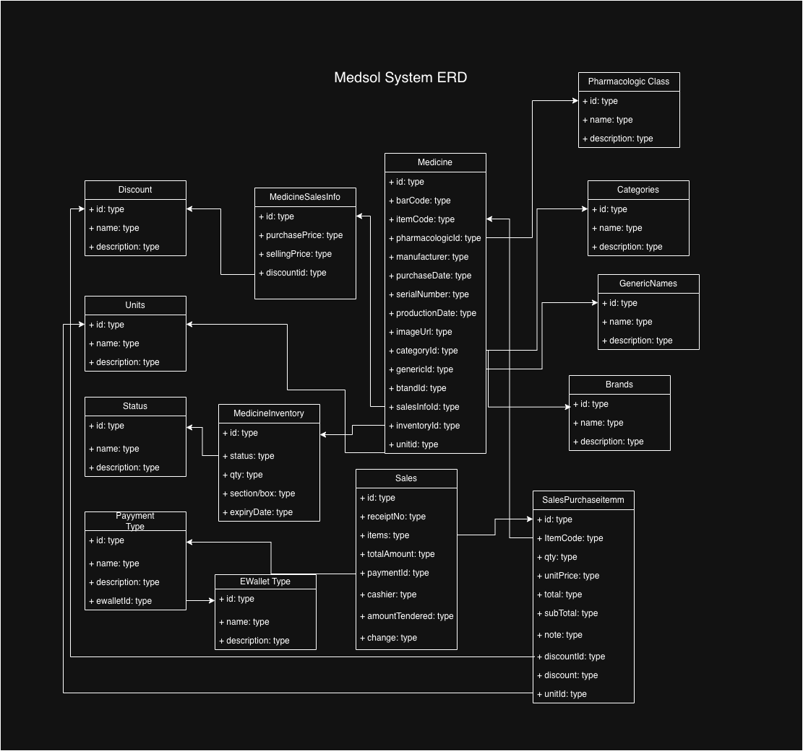

# Medsol API

## Overview

**Medsol** is a web app Point-of-Sale (POS) and Inventory Management web application built for pharmacies and medicine retailers.

The Medsol API handles the core business logic — tracking and managing medicine inventory, processing sales transactions, and maintaining accurate stock records across the system.

- **Name:** Medsol API
- **Description:** The Medsol API handles the core business logic — tracking and managing medicine inventory, processing sales transactions, and maintaining accurate stock records across the system.
- **Stack:** Node.js, Express, Prisma, PostgreSQL (Supabase)
- **Deployment:** Dockerized, deployed via Render, CI/CD via GitHub Actions

## ERD (Entity Relationship Diagram)



*Initial ERD for the Medsol database schema. Replace `./docs/erd-screenshot.png` with the actual screenshot.*

## Architecture

* Routes -> Controllers -> Services (via Service Factory) -> Prisma (DB)
* `config/` – env, database (Prisma client singleton), logger
* `controllers/` – handle req/res
* `services/` – business logic & DB access
* `factories/` – service factory (centralized instantiation)
* `validations/` – Joi schemas
* `middlewares/` – validation, error handling
* `utils/` – ApiError, catchAsync

## Setup

1. `cp .env.example .env` and update `DATABASE_URL`
2. `npm install`
3. `npm run prisma:generate`
4. `npm run prisma:migrate -- --name init`
5. `npm run dev`

## Scripts

* `npm run dev` – dev server (ts-node + nodemon)
* `npm run build` / `npm start` – production build & run
* `npm run prisma:studio` – Prisma Studio GUI

## API

* `GET /api/v1/health`
* `GET /api/v1/users`
* `GET /api/v1/users/:id`
* `POST /api/v1/users` `{ name, email }`
* `PATCH /api/v1/users/:id`
* `DELETE /api/v1/users/:id`

## CI/CD & Deployment

* **CI/CD:** GitHub Actions
  * Runs on push/PR — lint, build, and test the app
  * Triggers a deploy to Render on successful merge to `main`
* **Containerization:** Dockerfile packages the app for consistent builds across environments
* **Hosting:** [Render](https://render.com) — deploys the Dockerized app as a web service
* **Database:** [Supabase](https://supabase.com) — managed PostgreSQL instance, connected via `DATABASE_URL`

### Deployment flow

```
GitHub push → GitHub Actions (build/test) → Docker image build → Render (deploy) → Supabase (Postgres)
```

## License

This project is licensed under the [MIT License](./LICENSE).